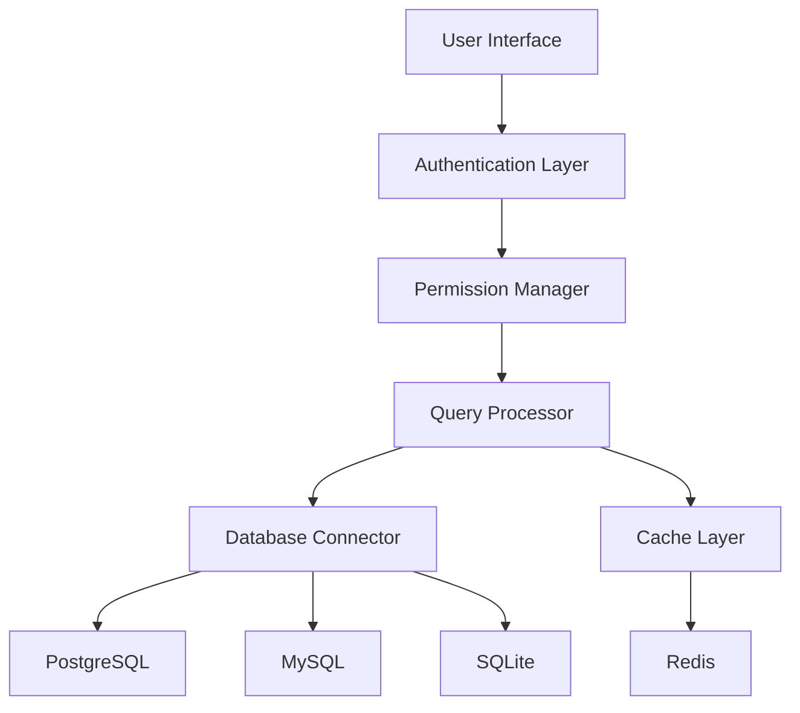

# Query/Database Management🔍

[](https://www.djangoproject.com/)
[](https://www.postgresql.org/)
[](https://www.mysql.com/)
[](https://www.sqlite.org/)
[](https://redis.io/)
[](https://tailwindcss.com/)
[](https://www.javascript.com/)
[](https://www.python.org/)

## About QueryCraft

**QueryCraft** is an enterprise-grade database management platform that revolutionizes how developers and data professionals interact with their databases. Built with security, performance, and usability at its core, QueryCraft bridges the gap between natural language and database operations.

> "QueryCraft transforms database interactions through intuitive interfaces and powerful capabilities, making complex operations accessible to developers at all levels."


## 🌟 Key Features

### Multi-Database Support
- **Seamless Integration**: Connect to PostgreSQL, MySQL, and SQLite databases
- **Unified Interface**: Manage multiple database engines through a single dashboard
- **Cloud Storage**: B2 integration for remote database file management

### Natural Language Query Engine
- **NL-to-SQL Conversion**: Transform plain English queries into executable SQL
- **Context-Aware Processing**: Intelligent query generation based on schema understanding
- **Query Optimization**: Automatic query refinement for performance

### Enterprise Security
- **Granular Permissions**: Role-based access with operation-specific controls
- **Request Rate Limiting**: Redis-backed protection against API abuse
- **Query Sanitization**: Comprehensive validation pipeline preventing injection attacks

### Developer Experience
- **Schema Visualization**: Interactive database schema exploration
- **Query History**: Track and reuse previous queries with version comparison
- **Performance Analytics**: Real-time execution statistics and bottleneck identification

## 📊 Technical Architecture



### Core Components

#### Database Connection Management
QueryCraft's connection pooling system intelligently manages database connections, optimizing resource utilization while ensuring reliability:

```python
# Dynamic connection handling with context management
def get_database_connection(db_type, connection_params):
    if db_type == 'SQLite':
        return sqlite_connection_manager(connection_params)
    elif db_type == 'PostgreSQL': 
        return postgres_connection_manager(connection_params)
    elif db_type == 'MySQL':
        return mysql_connection_manager(connection_params)
```

#### Security Implementation
Comprehensive permission management system with granular controls:

```python
# Flexible permission matrix for database operations
class DatabasePermissions(models.Model):
    user = models.ForeignKey(User, on_delete=models.CASCADE)
    can_select = models.BooleanField(default=True)
    can_insert = models.BooleanField(default=False)
    can_update = models.BooleanField(default=False)
    can_delete = models.BooleanField(default=False)
    can_drop = models.BooleanField(default=False)
    can_create = models.BooleanField(default=False)
```

## 🚀 Getting Started

### Prerequisites
- Python 3.8+
- Redis server
- Database engines (any of: PostgreSQL, MySQL, SQLite)

### Installation

1. **Clone the repository**
   ```bash
   git clone https://github.com/yourusername/querycraft.git
   cd querycraft
   ```

2. **Set up virtual environment**
   ```bash
   python -m venv venv
   source venv/bin/activate  # On Windows: venv\Scripts\activate
   ```

3. **Install dependencies**
   ```bash
   pip install -r requirements.txt
   ```

4. **Configure environment variables**
   ```bash
   cp .env.example .env
   # Edit .env with your configuration
   ```

5. **Run migrations**
   ```bash
   python manage.py migrate
   ```

6. **Start the development server**
   ```bash
   python manage.py runserver
   ```

7. **Access the application**
   
   Open your browser and navigate to `http://localhost:8000`

### Demo Access

For quick exploration, use our demo credentials:
- **Username**: TestUser
- **Password**: TestUser

*Note: Demo users have limited permissions with preset sample databases*

## 📝 Usage Examples

### Connecting to a Remote Database

```python
# In the web interface:
# 1. Navigate to Management > Upload Database
# 2. Select "PostgreSQL" as database type
# 3. Enter connection details:
#    - Host: your-db-host.com
#    - Port: 5432
#    - Database Name: your_database
#    - Username: your_username
#    - Password: your_password
```

### Natural Language Queries

Transform natural language questions into SQL:

| Natural Language Query | Generated SQL |
|------------------------|---------------|
| "Show me all active users who joined last month" | `SELECT * FROM users WHERE status = 'active' AND join_date >= DATE_TRUNC('month', CURRENT_DATE - INTERVAL '1 month') AND join_date < DATE_TRUNC('month', CURRENT_DATE)` |
| "Find the total sales by region for Q1" | `SELECT region, SUM(amount) as total_sales FROM sales WHERE date >= '2023-01-01' AND date <= '2023-03-31' GROUP BY region ORDER BY total_sales DESC` |

## 🛠️ Development

### Project Structure
```
querycraft/
├── auth/                  # Authentication components
├── static/                # Static assets (JS, CSS)
├── templates/             # HTML templates
│   ├── auth/              # Authentication templates
│   ├── base.html          # Base template
│   └── ...
├── utils/                 # Utility functions
│   ├── b2_utils.py        # B2 cloud storage utilities
│   └── cache_system.py    # Redis caching system
├── views.py               # Main view controllers
├── models.py              # Data models
└── urls.py                # URL routing
```

### Testing

```bash
# Run the test suite
python manage.py test

# Run specific tests
python manage.py test auth.tests
```

### Contributing

1. Fork the repository
2. Create a feature branch (`git checkout -b feature/amazing-feature`)
3. Commit your changes (`git commit -m 'Add some amazing feature'`)
4. Push to the branch (`git push origin feature/amazing-feature`)
5. Open a Pull Request

## 🔒 Security Features

QueryCraft implements multiple layers of security:

- **Input Sanitization**: Prevents SQL injection attacks
- **Authentication**: Session-based secure login system
- **Authorization**: Granular database operation permissions
- **Rate Limiting**: Protection against brute force and DoS attacks
- **Secure Connections**: Support for SSL/TLS encrypted database connections

## 📈 Roadmap

- [ ] **GraphQL Support**: Add GraphQL endpoint for frontend integration
- [ ] **Database Migration Tools**: Schema migration and versioning
- [ ] **Advanced Analytics**: Query performance monitoring and optimization suggestions
- [ ] **AI-Powered Schema Design**: Intelligent schema recommendations
- [ ] **Expanded Cloud Integrations**: AWS, Azure, and GCP support

## 📄 License

This project is licensed under the MIT License - see the [LICENSE](LICENSE) file for details.

## 🤝 Acknowledgements

- [Django](https://www.djangoproject.com/) - The web framework used
- [Redis](https://redis.io/) - For caching and rate limiting
- [Backblaze B2](https://www.backblaze.com/b2/cloud-storage.html) - For cloud storage integration

---

## 📬 Contact & Support

- **Creator**: Ayanle Aideed
- **LinkedIn**: [Ayanle Aideed](https://www.linkedin.com/in/ayanle-aideed-118752252/)
- **GitHub**: [Ayanleaideed](https://github.com/Ayanleaideed)

---

<p align="center">
  Made with ❤️ by Ayanle Aideed
</p>
