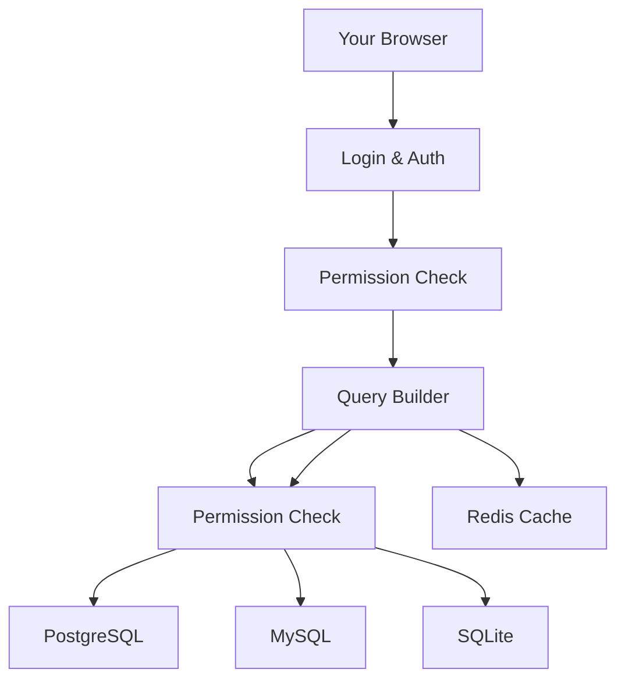

# DBMaster Pro 🛠️

[](https://www.djangoproject.com/)
[](https://www.postgresql.org/)
[](https://www.mysql.com/)
[](https://www.sqlite.org/)
[](https://redis.io/)
[](https://tailwindcss.com/)
[](https://www.javascript.com/)
[](https://www.python.org/)

## What's DBMaster Pro?

Let's face it – managing databases can be a real headache. I built DBMaster Pro after years of fighting with clunky database tools that made simple tasks feel impossible. This isn't just another database manager; it's the tool I wish I had when I started working with data.

DBMaster Pro lets you talk to your databases in plain English, handles multiple database types without breaking a sweat, and keeps everything secure without the usual configuration nightmare. Whether you're a seasoned DBA or just getting started with SQL, this tool will make your life easier.


## ✨ Why You'll Love It

### Works With All Your Databases
- Connect to PostgreSQL, MySQL, or SQLite without switching tools
- Manage cloud or local databases through one clean interface
- Store database files in the cloud with B2 integration (no more "it works on my machine" problems)

### Ask Questions in Plain English
- Type questions like "show me all users who signed up last month" and get results
- The tool figures out your database structure and builds proper SQL
- Saves your queries so you can reuse or modify them later

### Rock-Solid Security
- Control exactly who can do what (SELECT, INSERT, DELETE, etc.)
- Prevents SQL injection attacks automatically
- Rate limiting to stop brute force attempts
- Detailed audit logs of who did what and when

### Built for Real Developers
- No unnecessary clicks – clean interface that doesn't get in your way
- Visual database schema explorer that actually makes sense
- Performance stats that help you spot and fix slow queries

## 🔧 How It Works



### The Secret Sauce

#### Smart Connection Management
The app handles connection pooling behind the scenes, so you don't waste time reconnecting:

```python
# We handle all the connection details so you don't have to
def get_db_connection(db_type, connection_info):
    # Simplified - the real code has more error handling
    if db_type == 'SQLite':
        return sqlite3.connect(connection_info.file.path)
    elif db_type == 'PostgreSQL': 
        return psycopg2.connect(
            dbname=connection_info.dbname,
            user=connection_info.user,
            password=connection_info.password,
            host=connection_info.host,
            port=connection_info.port
        )
    # Similar for MySQL...
```

#### Flexible Permissions
Lock down exactly what each person can do:

```python
# Real permissions example from the codebase
class DatabasePermissions(models.Model):
    user = models.ForeignKey(User, on_delete=models.CASCADE)
    can_select = models.BooleanField(default=True)  # Can run SELECT queries
    can_insert = models.BooleanField(default=False) # Can run INSERT queries
    can_update = models.BooleanField(default=False) # Can run UPDATE queries
    can_delete = models.BooleanField(default=False) # Can run DELETE queries
    can_drop = models.BooleanField(default=False)   # Can drop tables
    can_create = models.BooleanField(default=False) # Can create tables
```

## 🚀 Getting Started

### What You'll Need
- Python 3.8 or newer
- Redis
- Any of PostgreSQL, MySQL, or SQLite

### Setting Up

1. **Grab the code**
   ```bash
   git clone https://github.com/Ayanleaideed/Natural-Language-to-SQL.git
   cd Natural-Language-to-SQL
   ```

2. **Create your virtual environment**
   ```bash
   python -m venv venv
   source venv/bin/activate  # On Windows: venv\Scripts\activate
   ```

3. **Install the requirements**
   ```bash
   pip install -r requirements.txt
   ```

4. **Set up your environment**
   ```bash
   cp .env.example .env
   # Open .env and fill in your details
   ```

5. **Run migrations**
   ```bash
   python manage.py migrate
   ```

6. **Start it up**
   ```bash
   python manage.py runserver
   ```

7. **Check it out**
   
   Open your browser and go to `http://localhost:8000`

### Want to try before installing?

Use our demo account to poke around:
- **Username**: TestUser
- **Password**: TestUser

*This account has sample databases ready to go, but limited permissions for safety*

## 💡 Real-World Examples

### Connecting to Your Database

Just fill in your database details in the simple form:

```
Host: db.mycompany.com
Port: 5432
Database: customer_data
Username: app_user
Password: ************
```

### Natural Language in Action

Here's how real questions turn into SQL:

| What You Ask | What It Runs |
|--------------|--------------|
| "Who are our newest customers?" | `SELECT * FROM customers ORDER BY signup_date DESC LIMIT 10` |
| "What was our total revenue last month?" | `SELECT SUM(amount) FROM orders WHERE order_date BETWEEN DATE_TRUNC('month', CURRENT_DATE - INTERVAL '1 month') AND DATE_TRUNC('month', CURRENT_DATE)` |

## 🧰 Development Details

### Project Structure
```
dbmaster-pro/
├── auth/                  # Login stuff
├── static/                # CSS and JavaScript
├── templates/             # HTML templates
│   ├── auth/              # Login pages
│   ├── base.html          # Main template
│   └── ...                # Other pages
├── utils/                 # Helper functions
│   ├── b2_utils.py        # Cloud storage functions
│   └── cache_system.py    # Redis caching
├── views.py               # Main code
├── models.py              # Database models
└── urls.py                # URL routing
```

### Running Tests

```bash
# Run all tests
python manage.py test

# Run just the authentication tests
python manage.py test auth.tests
```

### Want to Contribute?

1. Fork the repo
2. Make a branch (`git checkout -b fix-that-annoying-bug`)
3. Make your changes and commit them (`git commit -m 'Fixed that annoying bug'`)
4. Push your changes (`git push origin fix-that-annoying-bug`)
5. Open a Pull Request

## 🔒 Security Stuff

We take security seriously:

- All user input is sanitized to prevent SQL injection
- Database passwords are never stored in plaintext
- Rate limiting stops brute force attacks
- Fine-grained permissions let you control exactly who can do what
- SSL/TLS support for encrypted database connections

## 🔮 What's Next

Here's what I'm working on:

- [ ] **GraphQL Support**: For modern frontend integration
- [ ] **Database Migration Tools**: For easier schema changes
- [ ] **Query Optimizer**: Get suggestions to make your queries faster
- [ ] **AI Schema Suggestions**: Get recommendations for better database design
- [ ] **More Cloud Options**: AWS, Azure, and GCP integrations

## 📜 License

This project is under the MIT License - see [LICENSE](LICENSE) for the legal stuff.

## 👏 Thanks

- The Django team for their amazing framework
- Redis for making caching so much easier
- Backblaze for their affordable B2 storage

---

## 📫 Get In Touch

- **Creator**: Ayanle Aideed
- **LinkedIn**: [Ayanle Aideed](https://www.linkedin.com/in/ayanle-aideed-118752252/)
- **GitHub**: [Ayanleaideed](https://github.com/Ayanleaideed)

---

<p align="center">
  Built with ☕ and 🤬 (debugging) by Ayanle Aideed
</p>
