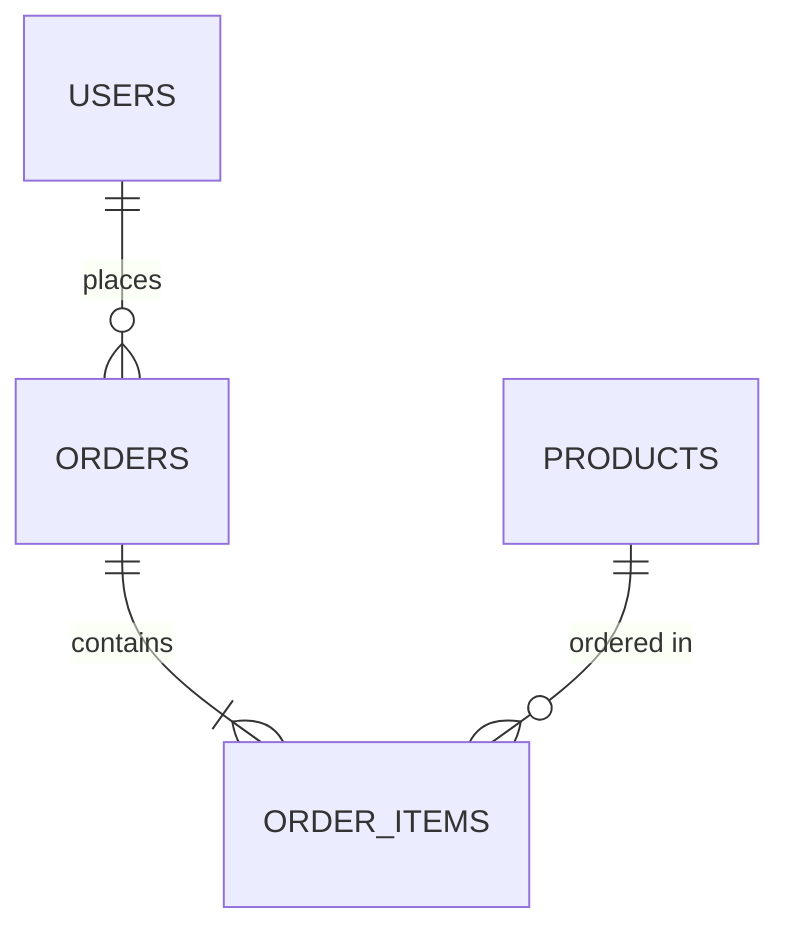

# Schema Guidelines

## Database Schema Format

```sql
CREATE TABLE users (
    id INTEGER PRIMARY KEY,
    name TEXT NOT NULL,
    email TEXT UNIQUE,
    created_at TIMESTAMP
);
```

## Schema Definition

Use YAML format for schema definitions:

```yaml
tables:
  users:
    columns:
      - name: id
        type: integer
        primary_key: true
      - name: email
        type: string
        unique: true
```

## Relationships



## Best Practices

1. Use clear naming conventions
2. Define relationships explicitly
3. Include proper indexing
4. Document constraints

## Schema Validation

Run validation using:

```bash
nlsql validate-schema /path/to/schema.yml
```

## Example Mappings

Natural Language to Schema:

- "customer" → users.name
- "purchase date" → orders.created_at
- "product price" → products.price
