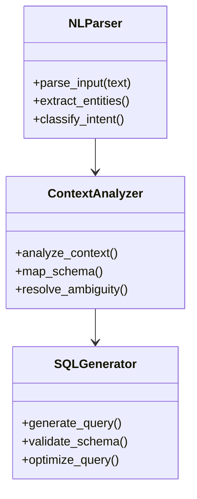

# Technical Documentation

## System Architecture

### Components

1. **Natural Language Parser**

   - Tokenization
   - Entity recognition
   - Intent classification

2. **Context Analyzer**

   - Schema mapping
   - Context resolution
   - Ambiguity handling

3. **SQL Generator**
   - Query structure generation
   - Schema validation
   - Parameter binding

## Data Flow

1. User input processing
2. Natural language understanding
3. Context analysis
4. SQL generation
5. Query optimization
6. Execution

## API Reference

### Endpoints

- `POST /api/convert`
- `GET /api/schemas`
- `POST /api/validate`

## Performance Optimization

1. Query caching
2. Schema indexing
3. Batch processing

## Security Considerations

- Input validation
- Query sanitization
- Access control
- Rate limiting

## Testing Strategy

1. Unit tests
2. Integration tests
3. Performance tests
4. Security tests
